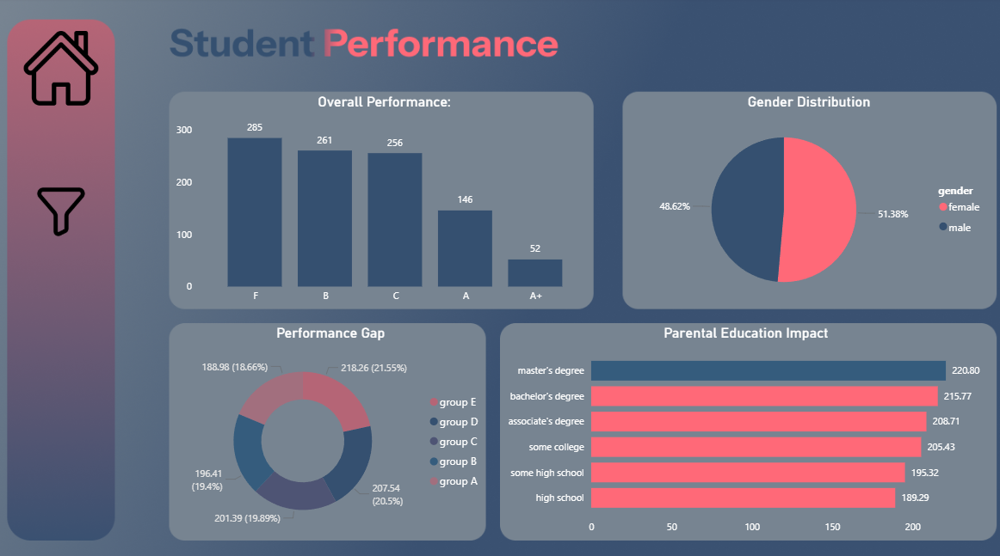
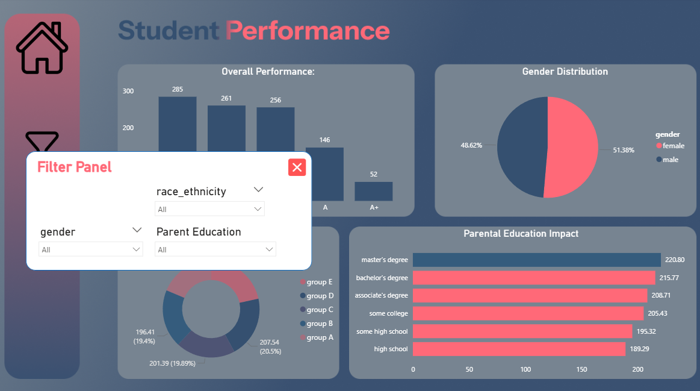

# 🎓 Student Performance Analysis Dashboard

## 🌟 Overview
This **Power BI dashboard** analyzes the factors influencing student academic performance. It provides a multi-dimensional view of how demographics, parental background, and social groups impact grades, helping educators identify performance gaps and trends.

## 🛠️ Key Components
The dashboard is divided into several analytical segments:

1.  **Overall Performance:** A distribution of student grades (from F to A+) to visualize the general academic standing.
2.  **Gender Distribution:** A breakdown of the student population by gender to ensure balanced analysis.
3.  **Parental Education Impact:** A detailed bar chart showing the correlation between parents' education levels and student scores.
4.  **Performance Gap (Ethnic Groups):** A donut chart analyzing how different social/ethnic groups perform relative to one another.

## 🎛️ Advanced UI Features
-   **Interactive Filter Panel:** Implemented a custom "Pop-up" filter menu using **Bookmarks and Selection Panes** to maximize screen real estate and keep the design clean.
-   **Custom UI Design:** Background and layout designed in **Figma** using a modern color palette for high readability.
-   **Dynamic Slicers:** Users can filter the entire report by Gender, Race/Ethnicity, and Parental Education levels.

## 💡 Key Metrics
- Detailed tracking of performance scores across 5 distinct social groups.
- Analysis of academic success across 6 different levels of parental education.
- Gender-based performance ratio (51.38% Female vs 48.62% Male).

## 🚀 Tech Stack
- **Power BI:** Data Visualization & Interactive UI Logic.
- **Figma:** UI/UX Background Design.

## 📂 Project Structure
- `power bi 2.pdix`: The Power BI project file.
- `F_V.png`: High-resolution images of the main view and the filter panel.

---
© 2026 Abdelrahman Ibrahim. All Rights Reserved.
